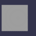

These models are intended to test using an individual buffer.  

The following table shows the properties that are set for every model.  

| Property | **Values** |
| :---: | :---: |
| Base Color Texture |  |

The following table shows the properties that are set for a given model.  

|   | Sample Image | Vertex UV 0 | Vertex Color |
| :---: | :---: | :---: | :---: |
| [00](Buffer_Misc_00.gltf) [View](https://bghgary.github.io/glTF-Assets-Viewer/?type=Positive&folder=25&model=0) |  | Float | Vector3 Float |
 